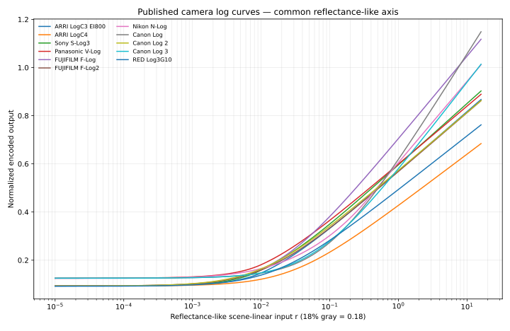
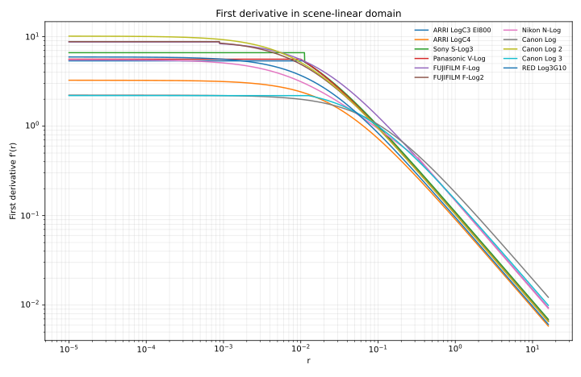
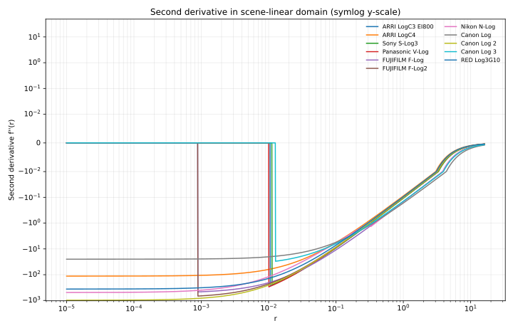
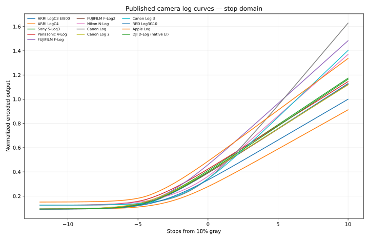
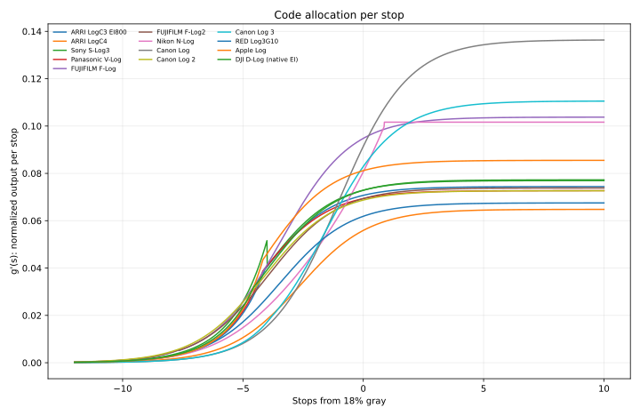
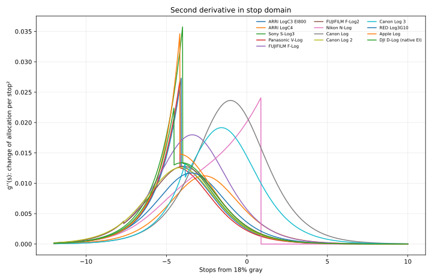
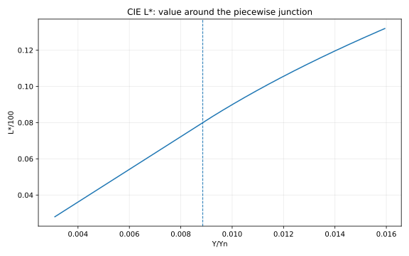
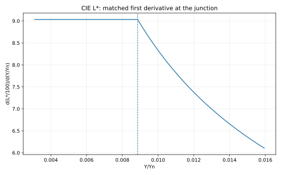
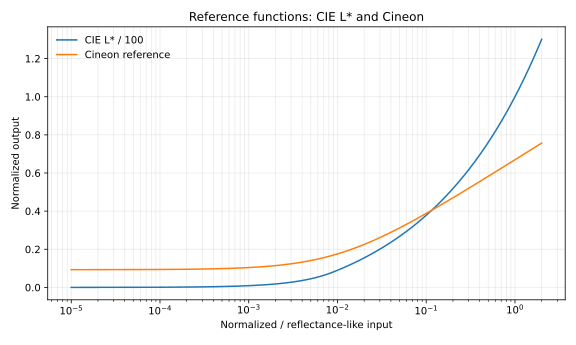

# このノートの範囲

このノートでは、各メーカーが公開している仕様書・データシート・ホワイトペーパーの**前向き符号化関数**を再実装し、同じ座標系に置いて比較します。実機の内部処理を直接検証したものではありません。センサー固有処理、EI依存処理、量子化、クリップ、メタデータ処理などは、公開式と異なる可能性があります。

したがって、ここでいう「ARRI LogC3」「S-Log3」「N-Log」などは、厳密には**公開文書に書かれた数式の実装**です。係数が有限桁で公表されている場合、接続点に見えるごく小さな値のずれが、設計上の不連続なのか、公開係数の丸めによるものなのかは区別できません。本稿ではその場合、`as printed`（公表式をそのまま計算した結果）として扱います。

CIE $L^*$ と Cineon は比較参照です。CIE $L^*$ は知覚的明度関数、Cineon はフィルム濃度をデジタル化するための系譜に属し、現代のカメラLogと同一カテゴリのOETFではありません。Cineonについては、Kodak/Cineonの既定値と、それを再記述したFilmLightの式を用いた**参照実装**です。[@kodak-cineon; @filmlight-cineon]

# 比較する関数

カメラLogについて、共通の入力変数を $r$ とします。ここでは比較の便宜上、$r=0.18$ を18%グレーに対応する scene-linear / reflectance-like 入力として扱います。

Canonのホワイトペーパーだけは、公開式の変数を `Scene Linear` とし、別途

$$
\mathrm{reflection}=0.9\times\mathrm{Scene\ Linear}
$$

と記載しています。したがって本比較ではCanonについて $u=r/0.9$ と置き換えてから公開式を適用しています。[@canon-log]

前向き符号化を

$$
y=f(r)
$$

とし、scene-linear軸では

$$
f'(r)=\frac{dy}{dr},\qquad
f''(r)=\frac{d^2y}{dr^2}
$$

を比較します。

また、18%グレーからの露光段数

$$
s=\log_2\frac{r}{0.18},\qquad r=0.18\,2^s
$$

を導入し、

$$
g(s)=f(0.18\,2^s)
$$

とすると、

$$
g'(s)=\ln 2\;r f'(r)
$$

$$
g''(s)=(\ln 2)^2\left[r f'(r)+r^2 f''(r)\right]
$$

です。$g'(s)$ は「1 stopあたりに符号空間をどれだけ割り当てるか」、$g''(s)$ はその割当量がstopごとにどう変化するか、と読めます。

# 実装したカメラLog

曲線の一覧は `curve_specs/curves.yaml` から生成しています。現在の対象は次の通りです。



新しい曲線が既存の数式モデルで表せる場合は、レジストリに1項目追加して再生成するだけで、比較図・CSV・チェックボックス・接続表・個別図・PDFまで同時に更新されます。新しい数式型の場合だけ `scripts/curve_models.py` にモデルを追加します。

## カーブ本体

{.overview-figure}

カーブ本体を重ねただけでも差は見えますが、設計上の違いは微分の方が読み取りやすくなります。

# Scene-linear軸での微分

## 1階微分

{.overview-figure}

$f'(r)$ は scene-linear 入力に対する局所ゲインです。低域を線形枝で処理する曲線では一定区間が現れ、対数枝へ入ると概ね $1/(ar+b)$ 型に低下します。

## 2階微分

{.overview-figure}

$f''(r)$ は局所ゲインの変化です。線形枝では0、対数枝では通常負となります。したがって、piecewiseな設計では接続点が2階微分で非常に目立ちます。

# Stop軸で見る

## カーブ本体

{.overview-figure}

## 1 stopあたりの符号配分

{.overview-figure}

この図は今回もっとも解釈しやすい図の一つです。純粋な $\log r$ なら、$r=0.18\,2^s$ を代入した後は $s$ に対する一次関数になるため、$g'(s)$ は一定になります。

Nikon N-Logは、$r\ge0.328$ で

$$
x=150\ln r+619
$$

と定義されているため、上側の枝では

$$
\frac{dx}{ds}=150\ln2
$$

が一定になります。つまりN-Logの上側は、stop軸では文字通り直線です。[@nikon-nlog]

## Stop軸の2階微分

{.overview-figure}

この表現では、「どこから1 stopあたりの配分がほぼ一定になるか」が見やすくなります。N-Log上側の $g''(s)=0$ はその典型例です。

# インタラクティブ比較と接続点拡大

静的な全体図は俯瞰用として残し、下の比較ウィンドウではチェックボックスで任意のカーブをハイライトできます。選択は scene-linear / stop 軸の6図に同時反映され、同じ選択に応じて接続点近傍の value・1階微分・2階微分も表示されます。

<iframe src="compare.html" style="width:100%;height:930px;border:1px solid #ddd;border-radius:8px;" loading="lazy"></iframe>

静的PDFではインタラクティブ要素を分岐し、全体図に加えて各カーブの個別コンタクトシートを収録しています。

# 18%グレーでの比較

`1023×y` と `1023×dy/dstop` は、正規化出力を単純に1023倍した**比較用の尺度**です。すべてのフォーマットのネイティブ10-bit符号値を意味しません。たとえばLogC4は12-bit指向の仕様として定義されています。[@arri-logc4]



# 接続点を比較する

piecewise関数では、接続点で何を一致させているかを分けて考えます。

- $C^0$：関数値が連続
- $C^1$：1階微分まで連続
- $C^2$：2階微分まで連続

以下は**公表式に印刷された係数をそのまま使った数値判定**です。`approx.` は公開係数の丸め精度ではほぼ一致する、という意味であり、メーカーの設計意図を断定するものではありません。



ここでかなり設計差が見えます。

S-Log3は関数値は接続していますが、公表式をそのまま微分すると線形枝とLog枝の傾きは一致しません。V-LogとLogC3は、公開係数の精度では1階微分までほぼ一致します。F-Log/F-Log2は値はほぼつながりますが、傾きには明確な差が残ります。N-Logはさらに異なり、低域が線形ではなく立方根です。[@sony-slog3; @panasonic-vlog; @arri-logc3; @fujifilm-flog; @fujifilm-flog2; @nikon-nlog]

Apple Logは、負値側のゼロ枝から放物線へ入り、$R_t=0.01$ でLog枝へ接続する三枝構成です。正の接続点では、公表係数の精度で関数値と1階微分がほぼ一致しますが、2階微分は一致しません。DJI D-Logは $r=0.0078$ で線形枝からLog枝へ移り、18%グレーは公開表で10-bit code 408です。X9版のホワイトペーパーも同じ linear-to-D-Log 変換式を示し、EIによって主にクリップレベル側が変わることを説明しています。[@apple-log; @dji-dlog-2017; @dji-dlog-x9]

Canon Log 3は中央に線形区間を持ち、その両側をLog枝で接続します。公開式では1階微分までほぼ一致します。一方、Canon Log / Log 2は0を境に符号反転したLog枝をつなぐ形で、0において $C^1$ ですが $C^2$ ではありません。[@canon-log]

LogC4とRED Log3G10の線形枝は負値側の延長として置かれています。したがって、通常の非負scene-linear入力だけを見ると接続は表に出ませんが、ポストプロダクションで負値を扱うときには意味を持ちます。[@arri-logc4; @red-log3g10]

# CIE Labを接続設計の比較例にする

CIE 1976 $L^*$ は、カメラLogとは目的が違います。しかし「線形枝と非線形枝をどうつなぐか」という問題の非常にきれいな比較例です。CIEの定義は、$t=Y/Y_n$ として [@cie-lab]

$$
f(t)=
\begin{cases}
 t^{1/3} & t>\delta^3\\
 \dfrac{t}{3\delta^2}+\dfrac{4}{29} & t\le\delta^3
\end{cases},\qquad
\delta=\frac{6}{29}
$$

$$
L^*=116f(t)-16
$$

です。

接続点 $t=\delta^3$ では、関数値だけでなく1階微分も一致します。

$$
\left.\frac{d}{dt}t^{1/3}\right|_{t=\delta^3}
=\frac{1}{3\delta^2}
$$

で、これは下側の線形枝の傾きそのものです。したがって **$C^1$ 連続**です。一方、線形枝の2階微分は0、立方根枝の2階微分は0ではないので **$C^2$ ではありません**。

{.overview-figure}

{.overview-figure}

この例を入れることで、「piecewiseであること」自体が問題なのではなく、**接続点で何階まで整合させるかが設計条件である**と整理できます。

# Cineonを歴史的な参照にする

Cineonは現代のカメラLogと同列には扱いません。もともとはネガフィルムの濃度情報を10-bit Logで保持するための仕組みで、基準黒95、基準白685、1 codeあたり0.002 densityという規約を持ちます。[@kodak-cineon]

ここでは後世の実装で広く用いられている、正規化linear値 $r$ からCineonへ写す参照式 [@filmlight-cineon]

$$
o=10^{(95-685)/300}
$$

$$
y=\frac{685+300\log_{10}\left(r(1-o)+o\right)}{1023}
$$

を使っています。この式は非負入力域で単一の滑らかなLog関数なので、カメラLogで見られるような低域のpiecewise接続はありません。

{.overview-figure}

Labは「意図的に$C^1$接続されたpiecewise関数」、Cineonは「単一のオフセット付きLog」という対照になり、現代カメラLogのtoe設計を眺める基準として使えます。

# ここまでで見えてくること

第一に、「Log」という名称だけでは局所構造はほとんど分かりません。純粋なLogに近い領域、線形toe、立方根toe、負値側の線形延長など、実際の公開式はかなり多様です。

第二に、カーブ本体より $f'(r)$ の方が符号配分を直接見せ、$f''(r)$ の方が接続と圧縮率の変化を露出させます。さらにstop軸へ移すと、純粋Logが「1 stopあたり一定の割当」に対応することが直接見えます。

第三に、接続条件は独立の設計軸として扱えます。Labのように$C^1$を明示的に満たす例を横に置くと、メーカーLogの接続が単なる実装上の細部ではなく、局所的な符号配分を決める条件であることが分かりやすくなります。

ただし、この比較から各カメラの「画質」「ダイナミックレンジ」「ノイズ性能」を直接順位づけることはできません。それらはセンサー、露出規約、量子化、ノイズ、クリッピング、後段処理まで含む別問題です。本稿が比較しているのは、あくまで**公開された1次元伝達関数そのもの**です。

# 次の拡張候補

次に進めるなら、単にメーカー数を増やすより、以下の三方向が有効です。

1. **逆関数の微分**：$dr/dy=1/f'(r)$ を描くと、符号値の誤差や量子化がscene-linear側でどれだけ増幅されるかを見る指標になります。
2. **量子化を加えた解析**：10-bit / 12-bitで1 codeが何stopに相当するかを各露光域で比較できます。
3. **接続設計の参照群を増やす**：ACEScctやHLGのようなpiecewise関数を加えると、camera Logだけでなく「低域を別枝で処理する伝達関数」という一般形で比較できます。

この方向まで進めると、Logカーブ比較というより「1次元伝達関数を局所ゲイン・曲率・接続条件で読む」ための小さな解析フレームワークになります。

# 一次資料リンク集

このページは解析ノートであると同時に、各社が公開しているLog仕様書・ホワイトペーパーへの索引としても使えるようにしています。以下の一覧も曲線レジストリから自動生成されます。



# 再現用ファイル

本ページのソースと再現用ファイルは GitHub リポジトリで公開します。主要ファイルは以下から直接参照できます。

- [GitHub repository](https://github.com/goldkiss2010-ai/log_curve_derivatives_github_pages)
- [Quarto source (`article.qmd`)](https://github.com/goldkiss2010-ai/log_curve_derivatives_github_pages/blob/main/article.qmd)
- [Generation scripts](https://github.com/goldkiss2010-ai/log_curve_derivatives_github_pages/tree/main/scripts)
- [Numerical data](https://github.com/goldkiss2010-ai/log_curve_derivatives_github_pages/tree/main/data)
- [BibTeX references](https://github.com/goldkiss2010-ai/log_curve_derivatives_github_pages/blob/main/references.bib)
- [Static PDF contact sheet](downloads/log-gamma-derivatives-contact-sheet.pdf)

本ノートに対応する生成スクリプトは `scripts/`、数値表は `data/` にまとめています。曲線定義は `curve_specs/curves.yaml`、出典情報は `curve_specs/sources.yaml` が基準です。`python scripts/build_all.py` を実行すると、CSV、SVG、インタラクティブ比較、個別図、静的PDF、参考文献、公開用 `index.html` を一括再生成します。SVGは `assets/figures/` にベクターのまま収録し、メーカーPDFそのものは再配布していません。詳しい追加手順は `ADDING_A_CURVE.md` に記載しています。

# 参考文献

::: {#refs}
:::
